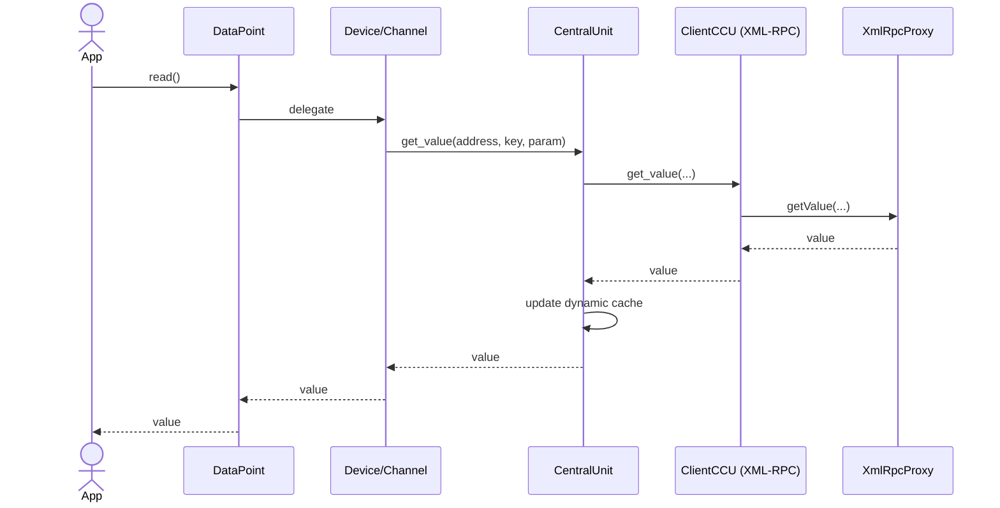
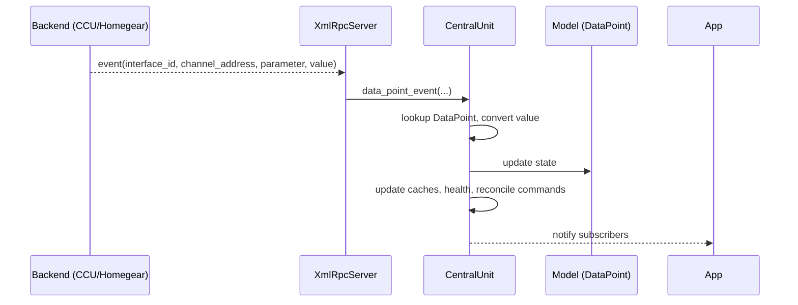
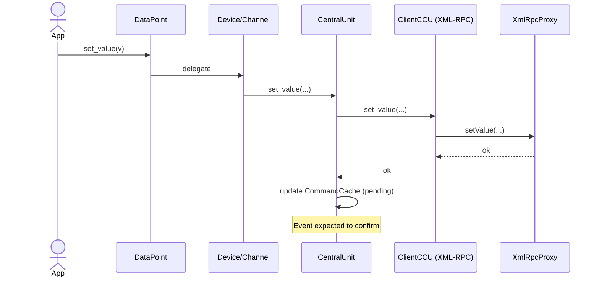

# Data flow: XML-RPC, JSON-RPC, events, and data point updates

This document describes the end-to-end flow of data through aiohomematic for the two main transport mechanisms (XML-RPC and JSON-RPC), how incoming events are handled, and how data point values are updated and propagated within the system.

Audience: Contributors and integrators who need a precise understanding of message paths, responsibilities, and lifecycle of values and events.

> **Terminology:** For definitions of Backend, Interface, Channel, Parameter, and Callback, see the [Glossary](glossary.md).

## Overview

- Outbound reads/writes use the client layer (XML-RPC or JSON-RPC) to talk to the backend (CCU/Homegear).
- Inbound events are pushed by the backend to aiohomematic’s local XML-RPC callback server run by Central.
- Central updates the model (Device/Channel/DataPoint) and dynamic caches and notifies subscribers.

## Key participants

- CentralUnit (aiohomematic/central): orchestrates clients, runs XML-RPC callback server, stores caches, and hosts the runtime model.
- Clients (aiohomematic/client): protocol adapters for XML-RPC (XmlRpcProxy) and JSON-RPC (JsonRpcAioHttpClient).
- Model (aiohomematic/model): Device, Channel, DataPoints, Events; strictly no network I/O.
- Store (aiohomematic/store): persistent descriptions, dynamic value/state caches, and diagnostic incident storage.

---

## 1. XML-RPC data flow

Purpose: Event callbacks from backend; many CCU operations can also be done via XML-RPC.

### Outbound calls (read/write)

1. A consumer reads a value: Central/Device/Channel delegates to Client.get_value(interface, address, paramset_key, parameter).
2. Client (XML-RPC) calls XmlRpcProxy.<method> towards the CCU/Homegear. Arguments are sanitized by \_cleanup_args.
3. The result is decoded and (if needed) converted in the model/support layer and returned to the caller. Central may store the value in the dynamic cache for the DataPointKey.
4. A consumer writes a value: DataPoint.set_value(...) delegates to Device/Channel/Client. Client uses XmlRpcProxy to invoke setValue (or paramset writes), and may record a pending command in CommandCache.

### Inbound events (push from backend)

1. Backend calls the local callback server started by Central (xml_rpc_server.XmlRpcServer), method RPCFunctions.event(interface_id, channel_address, parameter, value).
2. RPCFunctions looks up the Central for interface_id and forwards the event via decorators to Central's event_coordinator.data_point_event(...).
3. Central resolves the target DataPoint from (channel_address, parameter), converts value if needed, updates dynamic caches and the DataPoint's internal state.
4. Central publishes events via the EventBus system (DataPointValueReceivedEvent, DeviceStateChangedEvent, etc.). Subscribers receive notifications through the modern `subscribe_to_*` API. Connection health metadata (PingPongTracker, last-seen timestamps) is updated. PingPongTracker records incidents to IncidentStore when mismatch thresholds are exceeded. Pending CommandCache entries may be reconciled if the event confirms a write.
5. If the event indicates structural changes (newDevices, deleteDevices, updateDevice, replaceDevice, readdedDevice), the respective RPCFunctions handlers forward to Central which triggers model updates (reload descriptions, add/remove devices/channels).

---

## 2) JSON-RPC data flow

Purpose: Alternative/optional transport for CCU JSON API and ReGa interactions (programs, system variables, metadata, values).

### Outbound calls (read/write)

1. Consumer requests go through ClientCCU/ClientJsonCCU, which uses JsonRpcAioHttpClient.
2. JsonRpcAioHttpClient ensures an authenticated session (login or renew). Requests are posted via \_post/\_do_post with method names defined in \_JsonRpcMethod.
3. Responses are parsed safely (\_get_json_reponse) and converted to domain structures:
   - Device details → Names, Rooms, Functions
   - Device descriptions → DeviceDescription (ClientJsonCCU)
   - Paramset descriptions → ParameterData (ClientJsonCCU)
   - Program/system variable data → ProgramData/SystemVariableData
   - Values (get/set) are converted via model.support.convert_value where needed.
4. Dynamic caches in Central are updated. For writes, CommandCache may record the pending state until a confirming callback (if provided via XML-RPC) or a subsequent read reconciles the value.

### Inbound events

- JSON-RPC interface typically does not deliver push events. Event callbacks still arrive via the XML-RPC callback server. Therefore, even when JSON-RPC is used for reads/writes/metadata, XML-RPC event handling remains the main push channel.

---

## 3. Event handling inside Central

Trigger points

- RPCFunctions.event: raw value event.
- RPCFunctions.newDevices/deleteDevices/updateDevice/replaceDevice/readdedDevice: topology/config events.
- Error callback RPCFunctions.error: error conditions from the backend, forwarded as BackendSystemEvent for diagnostics.

### Processing steps for a value event

1. Identify DataPoint by channel_address and parameter.
2. Convert incoming raw value to the DataPoint's typed value when necessary (e.g., boolean normalization, levels).
3. Update in-memory value cache for DataPointKey and set modified/last-updated timestamps.
4. Update DataPoint internal state and publish events to subscribers via EventBus:
   - `DataPointValueReceivedEvent`: Notifies about value changes
   - `DeviceStateChangedEvent`: Notifies about device state changes
   - `FirmwareStateChangedEvent`: Notifies about firmware state changes
5. Subscribers receive notifications through the modern `subscribe_to_*` API (e.g., `subscribe_to_data_point_updated`, `subscribe_to_device_updated`).
6. Reconcile pending commands (if the new value matches a recent write) and adjust connection health markers.

### Error and edge cases

- Unknown channel/parameter: Central can log a warning and optionally trigger a metadata refresh to discover new parameters.
- Out-of-range/invalid payloads: values are validated and normalized by model.support and validators; unexpected fields are ignored with warnings.
- Lost connection: Clients raise NoConnectionException; Central may attempt reconnects. Writes can be queued or fail fast based on configuration.

---

## 4. Data point update lifecycle (pull and push)

### Pull (read)

- A read through Client.get_value updates the dynamic cache and the DataPoint state on return. Consumers can read from the DataPoint without immediate I/O if cache is fresh.

### Push (event)

- An event updates the cache and DataPoint first; a subsequent read will return the updated value without backend I/O.

### Write

- DataPoint.set_value delegates to Client.set_value or Client.put_paramset. Depending on the parameter, the update may be optimistic (cache updated immediately) or conservative (wait for confirmation via event). CommandCache tracks in-flight writes to prevent flapping.

---

## 5. Sequence diagrams (Mermaid)

Additional sequence diagrams for connect, device discovery, and state change propagation are available in docs/sequence_diagrams.md.

### Read value via XML-RPC

### Incoming event via XML-RPC

### Write value via XML-RPC

---

## 6. Where to look in code

- XML-RPC server: aiohomematic/central/rpc_server.py
  - RPCFunctions.event/newDevices/... and XmlRpcServer lifecycle
- XML-RPC client: aiohomematic/client/rpc_proxy.py
  - AioXmlRpcProxy, supported methods, async request handling
- JSON-RPC client: aiohomematic/client/json_rpc.py
  - JsonRpcAioHttpClient, login/session, methods, conversions
- Client: aiohomematic/client/**init**.py
  - ClientCCU, ClientHomegear, ClientJsonCCU
- Model and updates: aiohomematic/model/device.py and subpackages
  - Device/Channel, DataPoint types, value cache, update flow
- Events: aiohomematic/model/event.py

---

## Notes

- Tests under tests/ verify many of these flows; see tests/test_central.py, tests/test_client_json_rpc_client.py, tests/test_central_event_bus.py, tests/test_central_event_coordinator.py, and device/data point related tests.
